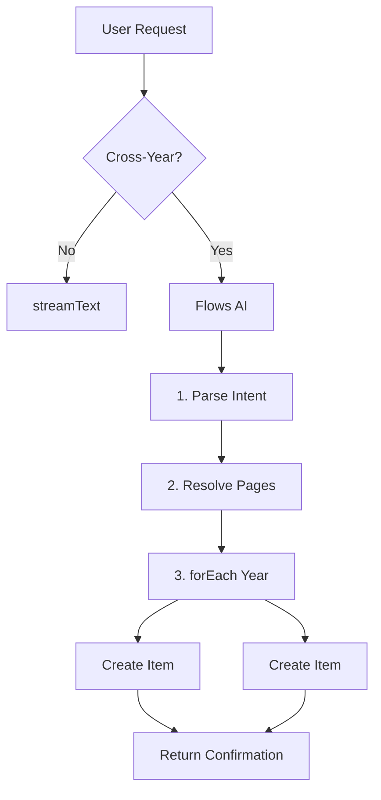

# Flows AI Implementation - Complete Package

**Created:** January 2025  
**Purpose:** Solve AI continuation issues with deterministic multi-step workflows  
**Status:** Ready for implementation

---

## 📦 What's Included

This package contains everything needed to implement Flows AI in the Year Wheel POC:

### 1. Strategy Document
**File:** `FLOWS_AI_IMPLEMENTATION_STRATEGY.md`

**Contains:**
- Complete architecture design
- Detailed implementation plan (3 phases)
- Agent definitions with code examples
- Flow structures with real implementations
- Testing scenarios
- Rollback strategy
- Timeline estimates (3-5 hours core, 5-8 hours with advanced features)

**Use when:**
- Understanding the overall approach
- Making architectural decisions
- Explaining the solution to others

---

### 2. TODO Checklist
**File:** `FLOWS_AI_TODO.md`

**Contains:**
- Step-by-step checklist
- Clear acceptance criteria per task
- Verification steps
- Rollback plan
- Current status tracking

**Use when:**
- Implementing the solution (primary working document)
- Tracking progress
- Verifying completion

---

### 3. Quick Reference
**File:** `FLOWS_AI_QUICK_REFERENCE.md`

**Contains:**
- Core patterns (sequence, forEach, oneOf, parallel, evaluator)
- Agent definitions
- Execution examples
- Context passing
- Zod schemas
- Error handling
- Debugging tips
- Common pitfalls

**Use when:**
- Writing code
- Looking up syntax
- Debugging issues
- Quick lookups during implementation

---

## 🎯 Problem Being Solved

### Current Issue
```
User: "skapa julkampanj 2025-12-15 till 2026-01-30"

AI Behavior:
1. ✅ getAvailablePages() - Executes successfully
2. ❌ STOPS - Doesn't continue to createItem()
3. ❌ User sees: "Here are the available pages..." (useless)
```

### Root Cause
- Vercel AI SDK's `maxSteps` is a limit, not a guarantee
- GPT-4 models decide when to stop
- No prompt engineering can force continuation
- Architecture issue, not model issue

### Solution with Flows AI
```
User: "skapa julkampanj 2025-12-15 till 2026-01-30"

Flow Execution (Deterministic):
1. ✅ parseIntent → extracts dates
2. ✅ resolvePages → maps to page IDs
3. ✅ forEach → creates items on each page
4. ✅ return → "Aktivitet skapad över 2 år!"

Result: ALL STEPS GUARANTEED TO EXECUTE
```

---

## 🏗️ Architecture Overview

### Hybrid Approach

**Simple queries → streamText (existing)**
```javascript
User: "vilka ringar finns?"
→ Uses existing Vercel AI SDK with tools
→ Fast, reactive, works perfectly
```

**Complex workflows → Flows AI (new)**
```javascript
User: "skapa julkampanj 2025-12-15 till 2026-01-30"
→ Uses Flows AI sequence + forEach
→ Deterministic, guaranteed execution
```

### Flow Structure



---

## 📁 Files to Create

### 1. `src/services/aiAgents.js` (NEW)
**Purpose:** Define all AI agents

**Agents:**
- `intentParserAgent` - Extracts structured data from user message (LLM)
- `pageResolverAgent` - Maps dates to page IDs (Pure function)
- `itemCreatorAgent` - Creates items in database (Wrapper)

**Size:** ~150 lines

---

### 2. `src/services/aiFlows.js` (NEW)
**Purpose:** Define workflow orchestrations

**Flows:**
- `crossYearActivityFlow` - Handles activities spanning multiple years
- `singleYearActivityFlow` - Optional, for single-year activities

**Size:** ~80 lines

---

### 3. `src/components/AIAssistant.jsx` (MODIFIED)
**Purpose:** Integrate Flows AI

**Changes:**
- Add imports for Flows AI
- Add `detectCrossYearRequest()` helper
- Add flow execution before streamText
- Keep existing streamText for simple queries

**Size:** +100 lines (additions only)

---

## 🔧 Implementation Steps

### Phase 1: Core Implementation (2-3 hours)

```bash
# Step 1: Create agent definitions
touch src/services/aiAgents.js
# → Implement intentParserAgent, pageResolverAgent, itemCreatorAgent

# Step 2: Create flow definitions
touch src/services/aiFlows.js
# → Implement crossYearActivityFlow using sequence + forEach

# Step 3: Integrate into AIAssistant
# → Add detectCrossYearRequest()
# → Add execute() before streamText

# Step 4: Test
yarn dev
# → Test: "skapa julkampanj 2025-12-15 till 2026-01-30"
```

### Phase 2: Testing & Refinement (1-2 hours)

```bash
# Test various scenarios:
# - Cross-year activities
# - Single-year activities (fallback)
# - Deletion persistence
# - Natural language variations

# Refine prompts based on results
```

### Phase 3: Advanced Features (OPTIONAL, 2-3 hours)

```bash
# Add batch creation
# Add conditional routing (oneOf)
# Add evaluation flow
```

---

## 📊 Success Metrics

### Must-Have (Phase 1 Complete)
- ✅ Cross-year activities created without stopping mid-flow
- ✅ Console logs show deterministic execution
- ✅ Items appear on correct pages
- ✅ Deleted items don't reappear
- ✅ Simple queries still work

### Nice-to-Have (Phase 3)
- ✅ Batch creation works
- ✅ Conditional routing implemented
- ✅ Evaluation flow validates results

---

## 🚀 Quick Start

**If you just want to get started RIGHT NOW:**

### Step 0: Run Database Migration (BLOCKING)
```sql
-- In Supabase Dashboard → SQL Editor
-- Paste and run: ADD_PAGE_ID_TO_ITEMS.sql
```

### Step 1: Create aiAgents.js
```bash
touch src/services/aiAgents.js
```

Copy the intentParserAgent, pageResolverAgent, and itemCreatorAgent from the Strategy document.

### Step 2: Create aiFlows.js
```bash
touch src/services/aiFlows.js
```

Copy the crossYearActivityFlow from the Strategy document.

### Step 3: Update AIAssistant.jsx
Add imports and `detectCrossYearRequest()` from the Strategy document.

### Step 4: Test
```bash
yarn dev
```

Try: "skapa julkampanj 2025-12-15 till 2026-01-30"

Watch console for `[Flows AI]` logs.

---

## 🐛 Debugging

### If flow doesn't execute:
1. Check console for `[Flows AI] Starting:` logs
2. Verify agent names match in flow definition and execute()
3. Check detectCrossYearRequest() returns true
4. Verify database migration ran successfully

### If items don't appear:
1. Check onFlowFinish logs for results
2. Verify wheelUpdate callback is called
3. Check items table in Supabase for page_id values

### If AI still stops:
1. Verify you're actually using Flows AI (check logs)
2. Make sure detectCrossYearRequest() is working
3. Check for errors in execute() try-catch

---

## 📚 Documentation Reference

### Primary Documents (This Package)
- `FLOWS_AI_IMPLEMENTATION_STRATEGY.md` - Complete strategy
- `FLOWS_AI_TODO.md` - Step-by-step checklist
- `FLOWS_AI_QUICK_REFERENCE.md` - Code snippets and patterns

### Background Documents
- `AI_CRITICAL_ARCHITECTURE_PROBLEMS.md` - Problem analysis
- `OPTION_B_IMPLEMENTATION_COMPLETE.md` - Architecture redesign
- `AI_NOT_CONTINUING_DEBUG.md` - Debugging attempts
- `FLOWS_AI_SOLUTION.md` - Initial research

### Database
- `ADD_PAGE_ID_TO_ITEMS.sql` - Required migration

### External
- https://flows-ai.callstack.com/ - Official docs
- https://github.com/callstackincubator/flows-ai - Source code

---

## ⚠️ Critical Prerequisites

Before starting implementation:

1. **Database Migration MUST be run**
   - File: `ADD_PAGE_ID_TO_ITEMS.sql`
   - Location: Supabase Dashboard → SQL Editor
   - Verify: `SELECT * FROM items WHERE page_id IS NULL;` returns 0 rows

2. **flows-ai package is installed**
   - ✅ Already installed via `yarn add flows-ai`

3. **Option B architecture is implemented**
   - ✅ fetchPageData exists
   - ✅ aiCreateItem uses page_id
   - ✅ fetchWheel doesn't fetch items

---

## 🎉 Expected Outcome

### Before (Broken)
```
User: "skapa julkampanj 2025-12-15 till 2026-01-30"
AI: "Here are the available pages: ..."
User: "WTF?? Create the activity!"
AI: "Here are the available pages: ..." (repeats)
```

### After (Working)
```
User: "skapa julkampanj 2025-12-15 till 2026-01-30"
AI: "[Flows AI] Starting: parseIntent"
AI: "[Flows AI] Finished: parseIntent"
AI: "[Flows AI] Starting: resolvePages"
AI: "[Flows AI] Finished: resolvePages"
AI: "[Flows AI] Starting: createItem (page 2025)"
AI: "[Flows AI] Finished: createItem (page 2025)"
AI: "[Flows AI] Starting: createItem (page 2026)"
AI: "[Flows AI] Finished: createItem (page 2026)"
AI: "Klart! Aktivitet 'julkampanj' skapad över 2 år (2025-2026)."

UI: ✅ Item visible on 2025 page (Dec 15-31)
UI: ✅ Item visible on 2026 page (Jan 1-30)
```

---

## 🔄 Rollback Strategy

If Flows AI causes issues:

### Option 1: Feature Flag
```javascript
const USE_FLOWS_AI = false; // Set to false to disable

if (USE_FLOWS_AI && detectCrossYearRequest(userMessage)) {
  // Flows AI
} else {
  // streamText
}
```

### Option 2: Revert Changes
```bash
git checkout HEAD -- src/components/AIAssistant.jsx
rm src/services/aiAgents.js
rm src/services/aiFlows.js
```

App will work exactly as before (with AI stopping issue, but functional).

---

## 💡 Key Insights

### Why Flows AI Solves This
1. **Deterministic Execution**
   - Flow structure defines steps, not model behavior
   - ALL steps guaranteed to run

2. **Context Passing**
   - Output from one step automatically becomes context for next
   - No need for model to "remember" to continue

3. **Built on Vercel AI SDK**
   - Uses same models and tools
   - Just adds orchestration layer
   - No breaking changes

### Why This is Better Than Prompt Engineering
```
Prompt Engineering:
- ❌ Model decides when to stop
- ❌ Unreliable across different models
- ❌ Breaks with context size changes
- ❌ Requires constant tuning

Flows AI:
- ✅ Flow structure decides execution
- ✅ Model-agnostic
- ✅ Predictable behavior
- ✅ Set it and forget it
```

---

## 🏁 Next Steps

1. **Read Strategy Document**
   - `FLOWS_AI_IMPLEMENTATION_STRATEGY.md`
   - Understand architecture

2. **Run Database Migration**
   - `ADD_PAGE_ID_TO_ITEMS.sql`
   - In Supabase Dashboard

3. **Follow TODO Checklist**
   - `FLOWS_AI_TODO.md`
   - Check off items as you complete them

4. **Use Quick Reference**
   - `FLOWS_AI_QUICK_REFERENCE.md`
   - Keep open while coding

5. **Test Thoroughly**
   - Cross-year activities
   - Single-year fallback
   - Deletion persistence

6. **Document Results**
   - Update README with findings
   - Note any refinements needed

---

## 📞 Support

**If you get stuck:**
1. Check Debugging section in Quick Reference
2. Review Common Pitfalls section
3. Check Flows AI examples: https://github.com/callstackincubator/flows-ai/tree/main/example
4. Re-read Strategy document for context

**If something is unclear:**
1. Strategy document has detailed explanations
2. Quick Reference has code examples
3. Official docs have comprehensive guides

---

## 📈 Timeline

**Minimum Viable (Phase 1):**
- Database migration: 5 minutes
- Create aiAgents.js: 45 minutes
- Create aiFlows.js: 30 minutes
- Update AIAssistant.jsx: 60 minutes
- Initial testing: 30 minutes
- **Total: ~3 hours**

**Complete (Phase 1 + 2):**
- Add refinement and testing: +2 hours
- **Total: ~5 hours**

**With Advanced Features (Phase 3):**
- Add batch creation, routing, evaluation: +3 hours
- **Total: ~8 hours**

---

## ✅ Definition of Done

Implementation is complete when:

- ✅ Database migration applied
- ✅ aiAgents.js created with 3 agents
- ✅ aiFlows.js created with crossYearActivityFlow
- ✅ AIAssistant.jsx integrated with Flows AI
- ✅ detectCrossYearRequest() works correctly
- ✅ Cross-year test case passes
- ✅ Simple query fallback works
- ✅ Console logs show flow execution
- ✅ Items appear on correct pages
- ✅ Deleted items don't reappear
- ✅ No TypeScript/ESLint errors
- ✅ No runtime errors in console
- ✅ Code is well-commented
- ✅ README updated

---

**⚠️ NOTE:** This document describes the NARROW approach (cross-year only).

**USE INSTEAD:** `FLOWS_AI_COMPLETE_PACKAGE.md` for the comprehensive approach.

**Comprehensive TODO:** `FLOWS_AI_COMPREHENSIVE_TODO.md`
