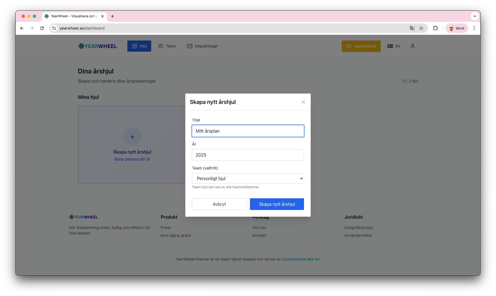
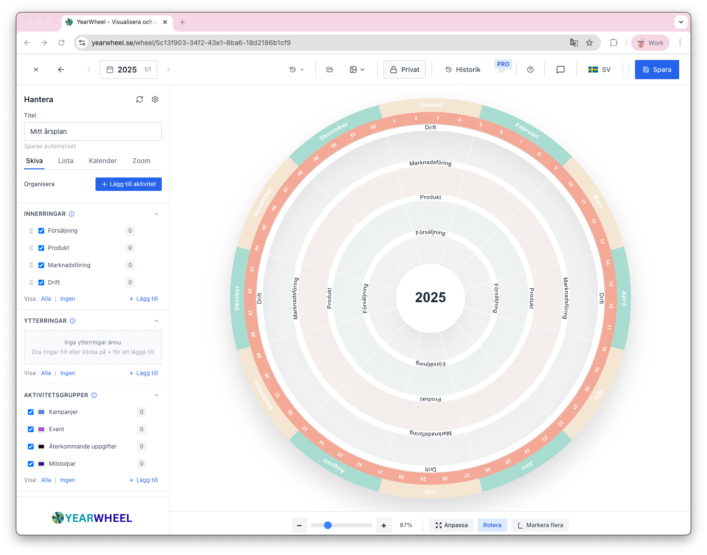
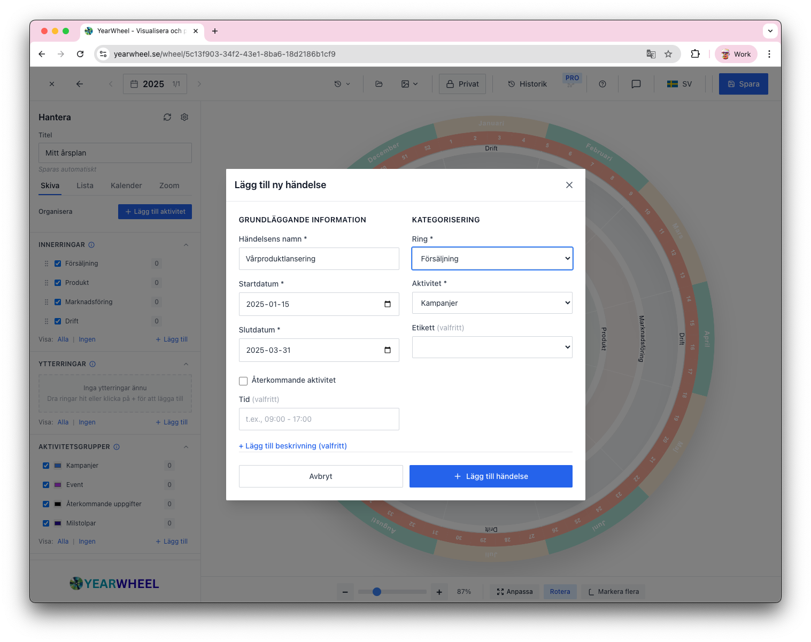
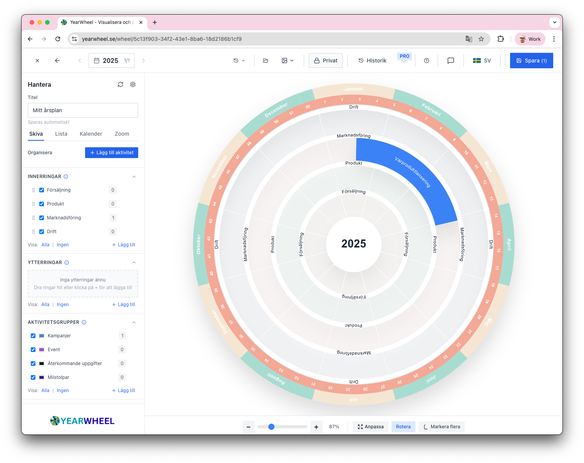
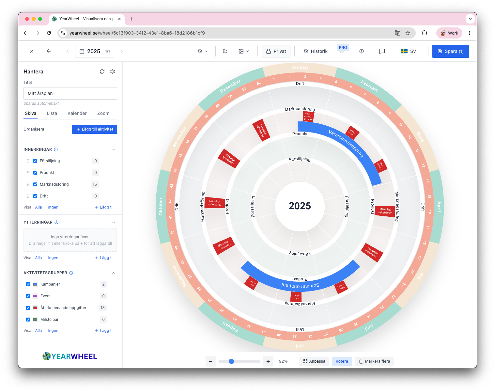
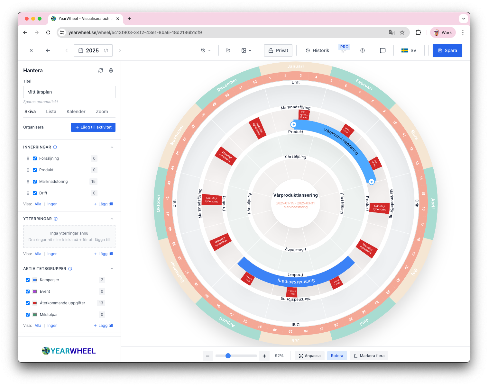
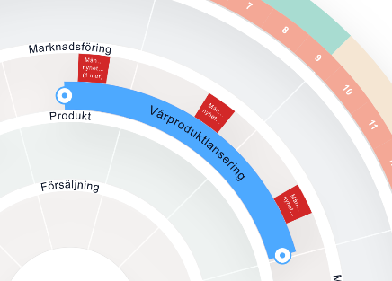

# Quick Start Guide

**Estimated time**: 5 minutes  
**Goal**: Create your first year wheel and add activities

---

## Step 1: Create Your Account

*YearWheel landing page - click "Get Started Free" to begin*

1. Go to [yearwheel.com](https://yearwheel.com)
2. Click **"Get Started Free"**

*Create account with email or use Google sign-in*

3. Enter your email and password or use your Google account
4. Check your email for verification link (optional for immediate use)

---

## Step 2: Create Your First Wheel

*Your dashboard - here you see all your year wheels*

1. Click **"Create New Wheel"** on your dashboard

*Give your wheel a title and select year*

2. Your wheel is created automatically with:
   - A month ring (Jan-Dec)
   - Default rings
   - The current year

*Your new year wheel has been created and appears on the dashboard*

---

## Step 3: Set Up Your Rings

*Editor view with side panel where you configure rings and activity groups*

**Rings** are the main categories in your wheel - like departments, projects, or focus areas. They appear as circular bands around the year wheel where you'll place activities.

1. Open the left sidebar (click ☰ if closed)
2. Find the **"Inner Rings"** section - your new wheel starts with one default ring called "Ring 1"
3. **Click directly on "Ring 1"** to edit the name
4. Type your first category (e.g., "Marketing") and press Tab or click outside
5. Click **"+ Add"** to add more rings (aim for 3-5 total)
6. Name each ring for your main categories

**Example rings:**
- **For business planning**: Marketing, Sales, Product, Operations
- **For personal planning**: Personal, Family, Work, Health
- **For project phases**: Planning, Development, Launch, Review

**Note**: Inner rings are closer to the center. You can also add Outer rings which appear on the outside edge of the wheel.

*The wheel now with multiple rings configured - Sales, Product, Marketing, Operations*

---

## Step 4: Create Activity Groups

**Activity Groups** determine the color of your activities. Think of them as color-coding categories - all activities in the same group will have the same color on your wheel.

1. Scroll to **"Activity Groups"** section (below the rings)
2. Click **"+ Add Activity Group"**
3. Enter a name (e.g., "Campaigns")
4. Choose a color (e.g., blue)
5. Click **"Add"**
6. Repeat to create 3-4 more groups with different colors

**Example groups:**
- **By type**: Campaigns, Events, Recurring Tasks, Milestones
- **By status**: Planned, In Progress, Completed
- **By priority**: High Priority, Medium Priority, Low Priority

**Why colors matter**: 
When you have many activities on your wheel, colors help you instantly recognize patterns - like seeing all Q2 activities at a glance, or spotting all high-priority items.

---

## Step 5: Add Your First Activity

An **activity** is any event, project, campaign, or task you want to track during the year. It appears as a colored arc on your wheel.

*Form for creating a new activity with all necessary fields*

1. Click **"+ Add Activity"** at the top of the sidebar
2. Fill in the form:
   - **Name**: "Spring Product Launch"
   - **Ring**: Select "Marketing" (this determines WHICH ring it appears in)
   - **Activity Group**: Select "Campaigns" (this determines the COLOR)
   - **Start Date**: Choose a date (e.g., January 15, 2025)
   - **End Date**: Choose a date (e.g., March 31, 2025)
   - **Description** (optional): Add details about this activity
3. Click **"Add Activity"**

Watch your activity appear on the wheel as a colored arc in the Marketing ring! 

*The wheel now shows your first activity - a blue arc in the Product ring for Spring Product Launch*

**What you'll see**: A colored segment (arc) that starts at January 15 and ends at March 31, positioned in the ring you selected, with the color from your activity group.

---

## Step 6: Add More Activities

Create 2-3 more activities to see how the wheel builds up. Each activity will stack on top of others in the same ring, creating a complete visual of your year.

**Activity 2:**
- Name: "Summer Campaign"
- Ring: Marketing
- Group: "Campaigns" (can use same or different color)
- Dates: June 1 - August 31, 2025

**Activity 3:**
- Name: "Monthly Newsletter"  
- Ring: Marketing
- Group: Recurring (if you created this group)
- Dates: January 20 - December 31, 2025. Select recurring event and mark "monthly". Choose the length of the activity.

*Form for recurring activities with frequency selection and preview of all dates*

**Tip**: If you have multiple rings (Marketing, Sales, Product), try adding activities to different rings to see how they appear as separate bands on the wheel.

*The wheel with multiple activities - see how recurring activities appear as red boxes each month*

---

## Step 7: Try Drag & Drop Editing

You can move and resize activities directly on the wheel!

**Moving an activity:**
1. **Hover** over an activity on the wheel
2. **Click and hold** in the middle of the activity
3. **Drag** to a different month or time period
4. **Release** to drop

The start and end dates update automatically! ✨

**Resizing an activity:**
1. **Hover** over the edge of an activity (left or right edge)
2. Wait for the cursor to change to resize arrows
3. **Click and drag** the edge to make it longer or shorter
4. **Release** when done

**Moving between rings:**
- You can also drag an activity **radially** (inward/outward) to move it to a different ring

*When you hover over an activity, the hand icon appears - click and drag to move*

*Close-up of the drag and drop feature - see how the cursor changes at the edges for resizing*

**Tip**: This is much faster than opening forms and changing dates manually. Most users do all their planning adjustments with drag and drop!

---

## What's Next?

Now that you have the basics, explore these powerful features:

- **Zoom Controls**: Use the Zoom tab in the sidebar to focus on specific months or quarters (perfect for planning meetings!)
- **[Presentation Mode](08_PRESENTATION.md)** - Hide rings using checkboxes to create different views for different audiences
- **[Export](11_EXPORT.md)** - Download your wheel as PNG, PDF, SVG, or JPG for presentations
- **[Teams](09_TEAMS.md)** - Invite colleagues to collaborate on shared wheels

---

## Need Help?

- 📖 **[Full Documentation](00_INDEX.md)**
- ❓ **[FAQ](reference/FAQ.md)**
- 💬 **[Contact Support](mailto:support@yearwheel.com)**

---

**Tip**: YearWheel auto-saves every change. Watch for the "Saved ✓" indicator in the top header!

**🇸🇪 Svenska**: [Snabbstartsguide](01_QUICK_START_sv.md)
